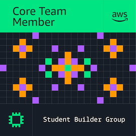

<h1 align="center">Hey there, I'm Daniel Suárez</h1>
<h3 align="center">Data Science & AI Engineering Student · Guayaquil, Ecuador</h3>

  
  

  
  &nbsp;&nbsp;&nbsp;
  
  &nbsp;&nbsp;&nbsp;
  

---

### About Me

- I love my family and music.

---

### Tech Stack & Tools

**Machine Learning & Artificial Intelligence**  

**Big Data & Data Engineering**  

**Cloud & DevOps**  

**Analytics & Visualization**  

**Backend & Web Apps**  

---

### Featured Projects

🌊 **[Godzilla-EnsoStreamingPipeline](https://github.com/Dass-19/Godzilla-EnsoStreamingPipeline)** — End-to-End Big Data Real-Time Streaming Architecture for El Niño (ENSO) flood risk monitoring in Guayaquil. Ingests multi-source climate and satellite data (NOAA, INAMHI, INOCAR, NASA POWER) via Apache Kafka, processes streaming events with Apache Spark, stores data in an HDFS Parquet Data Lake, and serves dynamic risk indices to an interactive OpenStreetMap Dashboard via FastAPI.

🗣️ **[longoApp](https://github.com/Dass-19/longoApp)** — Multilingual multimedia speech-to-text & translation system to Kichwa ecuatoriano. Extracts audio/video speech in Spanish/English and translates it directly into Kichwa. Integrates OpenAI Whisper (ASR) with a fine-tuned Meta NLLB-200 Machine Translation model, deployed via FastAPI, Docker, and Vercel.

🏥 **[agentMvp](https://github.com/Dass-19/agentMvp)** — RAG backend for a healthcare assistant. Built with LangGraph, FastAPI, Supabase (pgvector), and Llama-3-8B via Hugging Face Inference. Handles multi-turn conversations, semantic retrieval, and returns grounded HTML responses with cited sources.

🛡️ **[fraudIA-Novo-2S1R](https://github.com/Dass-19/fraudIA-Novo-2S1R)** — Insurance fraud detection system combining business rules, ML classification, SHAP explainability, and a natural language SQL agent (Gemini) for analytical queries. Exposes FastAPI endpoints for batch scoring, ingestion to PostgreSQL, and a conversational interface.

📈 **[LTSF](https://github.com/Dass-19/LTSF)** — Comparative study of Long-Term Time Series Forecasting methods. Implements a multi-layer LSTM in PyTorch with Xavier initialization, AdamW + ReduceLROnPlateau, and evaluates against linear baseline models on the ETTh1 dataset across prediction horizons H=96 and H=336.

🎓 **[AC Admisión & Nivelación](https://github.com/Dass-19/AC-Admision_Nivelacion)** — Conversational NLP agent that answers FAQs for admission and placement students at Universidad de Guayaquil.

📊 **[Student Dropout Prediction System](https://github.com/Dass-19/desercionEstudiantil)** — ML system that predicts student dropout risk using academic performance and attendance data. Built with CRISP-DM methodology and deployed as an interactive Streamlit app on Streamlit Cloud.

🏢 **[Sales Data Warehouse — AdventureWorks](https://github.com/Dass-19/sales-data-warehouse-adventureworks)** — Sales Data Warehouse built from AdventureWorks using a star schema, ETL pipelines in Pentaho, and PostgreSQL for analytics.

---

### GitHub Stats

  
  &nbsp;&nbsp;
  

---

<h3 align="center">Don't be afraid.</h3>
